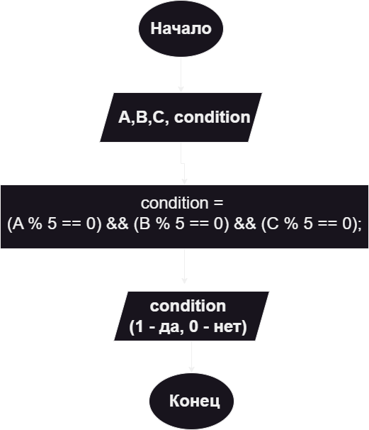

# LAB4DZ
# Домашняя работа (Условие)
4. Доставка грузов

Три груза (A, B, C кг) можно погрузить в контейнер, если вес каждого из них кратен пяти. Запишите условие, при котором диспетчерская система дает разрешение на погрузку.

# Алгоритм и блок-схема

### 1. Алгоритм

1. Объявить три целочисленные переменные A, B, C для хранения веса грузов.

2. Ввести значения A, B и C с клавиатуры.

3. Проверить, делится ли вес каждого груза на 5 без остатка.

4. Условие разрешения на погрузку:

(A % 5 == 0) && (B % 5 == 0) && (C % 5 == 0)

5. Если условие истинно, результат равен 1 — погрузка разрешена.

6. Если хотя бы один груз не кратен пяти, результат равен 0 — погрузка запрещена.

### Блок-схема



# 2. Реализация программы

Программа реализована на языке C.

Основное условие программы:

condition = (A % 5 == 0) && (B % 5 == 0) && (C % 5 == 0);

Оператор % определяет остаток от деления.

Если остаток от деления числа на 5 равен нулю, число кратно пяти.

Оператор && означает логическое "И", поэтому разрешение на погрузку выдается только тогда, когда все три груза удовлетворяют условию.

# 3. Результаты работы программы

Пример работы программы:
```
Введите значение A, B и C в кг: 10 25 40
Разрешение на загрузку (1 - да, 0 - не): 1
```
В данном случае все три значения кратны пяти, поэтому погрузка разрешена.

Пример, когда погрузка запрещена:
```
Введите значение A, B и C в кг: 10 23 40
Разрешение на загрузку (1 - да, 0 - не): 0
```
Значение 23 не кратно пяти, поэтому условие не выполняется.

# 4. Информация о разработчике

ФИО: Гордиенко Владимир Денисович

Группа: бОТИ-261
